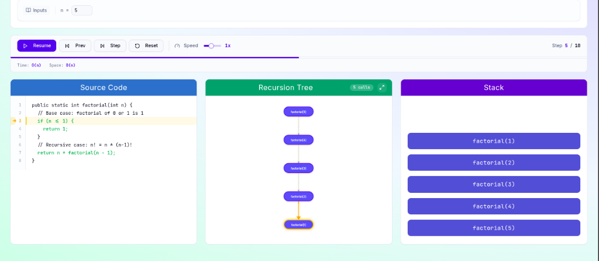
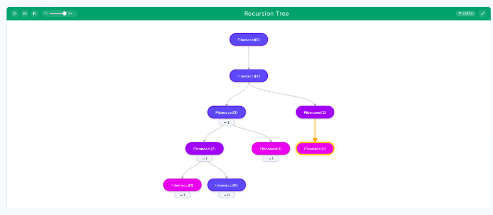

# 🔄 Recursion Visualizer


An interactive, web-based tool designed to help developers and students master recursion. Watch the call tree build in real-time, see the call stack grow and shrink, and understand complex recursive execution flows from the ground up.

---

## ✨ Features

- **Interactive Visualizations**: Real-time animation of recursive calls and returns.
- **Dynamic Call Tree**: Visual representation showing parent-child relationships and execution phases (calling, returning, base case).
- **Live Call Stack**: Tracks the current stack of active function calls, including parameters and return values.
- **Built-in Examples**: Includes classic algorithms like Factorial, Fibonacci, Binary Search, Merge Sort, and Quick Sort.
- **Custom Code Execution**: Write your own recursive functions and visualize their execution locally.
- **Multi-Language Support**: Supports JavaScript, Python, Java, and C/C++ (transpiled and executed securely).
- **100% Offline**: All code execution and analysis happen locally in your browser. No external API keys required!
- **Professional UI**: Clean, modern design with responsive layouts and smooth micro-animations.

---

## Gallery


*Figure 1: Factorial algorithm recursion tree, call stack, and source code visualization.*


*Figure 2: Fibonacci algorithm recursion tree showcasing dynamic branching.*

---

## 🚀 Quick Start

### Installation

Clone the repository and install dependencies:

```bash
git clone https://github.com/yuvnex/Recursion_Visualizer.git
cd Recursion_Visualizer
npm install
```

### Development

Start the Vite development server:

```bash
npm run dev
```

Open your browser to [http://localhost:5173](http://localhost:5173) and start visualizing!

### Build for Production

```bash
npm run build
npm run preview
```

---

## 💡 How to Use

### 1. Built-in Examples
Select from a variety of pre-loaded examples (e.g., Fibonacci, Quick Sort, Binary Search) using the sidebar to immediately see how they execute.

### 2. Visualize Custom Code
1. Switch to **"Custom Code"** mode.
2. Select your preferred programming language.
3. Write or paste your recursive function. Ensure your code has:
   - A clear **recursive function** definition.
   - A **base case** to terminate execution.
   - At least one **recursive call**.
   - A **function invocation** at the very end of the code snippet.
4. Click **"Analyze & Visualize"**.

**Example (JavaScript):**
```javascript
function factorial(n) {
  if (n <= 1) {
    return 1;
  }
  return n * factorial(n - 1);
}

// Ensure you call the function at the end!
factorial(5);
```

### 3. Understanding the Visualization

- **Recursion Tree:** Colored nodes indicate the execution phase:
  - 🟠 **Amber**: Currently executing (calling)
  - 🟣 **Purple**: Currently returning
  - 🟢 **Green**: Base cases
  - ⚫ **Gray**: Completed calls
- **Call Stack:** Updates as functions are called and return, displaying parameters and return values.
- **Code Editor:** Highlights the current line during execution (Green for base cases, Blue for recursive calls).

---

## 🛠️ Architecture & Tech Stack

### Tech Stack
- **Frontend Framework:** React 18, Vite
- **Styling & UI:** Tailwind CSS, Radix UI, Framer Motion (for smooth animations)
- **Execution Engine:** Custom JavaScript sandbox transpiler and code analyzer

### Core Modules
- **`src/lib/codeRunner.js`**: Code analysis, language transpilation (Python/Java/C++ to JS), and sandboxed execution engine with execution tracing.
- **`src/lib/recursionTreeBuilder.js`**: Computes tree structures, validates consistency, and generates the execution timeline.
- **`src/api/llmClient.js`**: Provides a unified analysis interface, delegating entirely to the local execution engine.

---

## ⚠️ Limitations & Known Issues

To ensure a smooth browser experience, there are a few built-in safeguards:
- **Maximum Recursion Depth:** Execution is capped at 500 calls to prevent browser crashes.
- **Simple Recursion Only:** Highly complex nested function calls across multiple independent methods may not trace correctly.
- **Single Function Trace:** The engine currently traces only one primary recursive function per execution.
- **Parameter Inference:** Best suited for simpler types (primitives, basic arrays, objects). Highly complex nested objects might not render fully in the stack trace.

---

## 🤝 Contributing

Contributions are welcome! 

**To add a new built-in example:**
1. Open `src/components/recursion/ExampleSelector.jsx`.
2. Add a new object to the `EXAMPLES` array with a unique `id`, `name`, `difficulty`, `description`, `input`, and `code`.

**To extend language support:**
1. Edit `src/lib/codeRunner.js`.
2. Update the `transpileToJS()` switch statement and add new language detection patterns.

---

## 📄 License

This project is licensed under the MIT License.

---

Built with ❤️ to make learning algorithms more intuitive and accessible.
